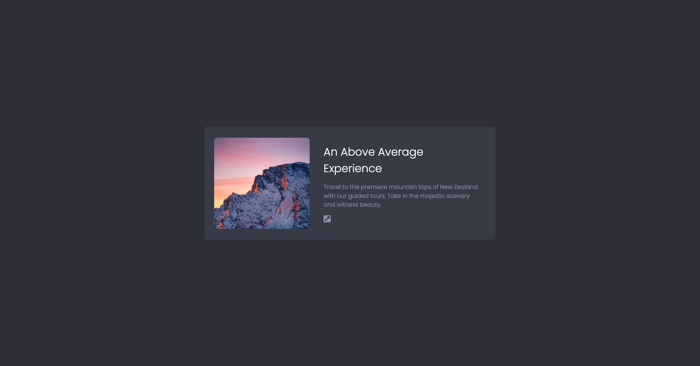

# Card UI Layout – Scrimba HTML & CSS Practice

This project is part of the Scrimba course on building websites with HTML and CSS. It focuses on creating a clean and responsive card component using only HTML and CSS — ideal for beginners looking to strengthen their layout and styling skills.

## 🚀 Features

- Semantic HTML structure
- Responsive design with Flexbox
- Clean and minimal card layout
- Simple styling for images, headings, and text

## 🛠️ Technologies Used

- HTML5
- CSS3
- Flexbox

## 📸 Preview

## 📂 Folder Structure

📁 Scrimba-HTML-CSS-Simple-Card
├── index.html
└── index.css

## 🧠 What I Learned

- How to use semantic tags for building structured content
- How to use Flexbox to center and align elements
- Styling and spacing content within a card layout

## 📚 Related Scrimba Lesson

This project is based on one of the practice projects from Scrimba's **"Build Websites with HTML and CSS"** course.

## ✅ How to Use

1. Clone or download the repository.
2. Open `index.html` in your browser.
3. Optionally, modify the content or styles to practice and experiment!

## 📄 License

This project is open-source and available under the [MIT License](LICENSE).
